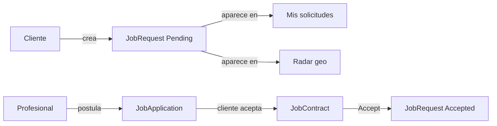

# Oficia App — Product Map

> How the product works (roles, pillars, flows). Living status lives in `docs/PROJECT_STATE.md`; this file is the UX/domain reference.

## Roles

| Role | Sees | Creates |
|------|------|---------|
| **Client** | Feed, Explore, Mis solicitudes, Perfil | `JobRequest` (work needed) |
| **Professional** | Feed, Explore, **Radar**, Perfil | Posts (portfolio), applications to open requests |

A user may hold both profile types over time; Radar is a **professional-only** surface.

## Pillars and satellites

### 1. Feed (immersive)
Social scroll of completed work (`Post`). Discover professionals visually and jump to hire / profile.

### 2. Explore (B2C marketplace)
Search professionals by category / text / filters. Public search endpoints. No “verified” badge until Domain has a real `IsVerified` (or equivalent) flag.

### 3. Radar (B2B — professionals only)
Geographic / proximity view of the **same** open `JobRequest` entities that clients manage under **Mis solicitudes**.
Inspired by nearby rental listings: scan what is close, open full detail, then **apply**.

### Mis solicitudes (client)
Client’s own job requests: create, list, track status, review applications, accept a professional.

### Perfil
Session bootstrap (`GET /api/users/me`) + profile UI. Username/email are real; stats, history, and avatar remain mock until profiles are wired.

## Radar ↔ Mis solicitudes (domain decision)

- **Application ≠ contract.** Many professionals may apply (`JobApplication`) to one open request.
- **`JobContract`** is created when the client **accepts** one application (agreed price + single professional link); then `JobRequest.Accept()`.
- Do **not** reuse `JobContract` as the apply/postulate step.
- **Location:** Domain has no lat/lng/address yet — map/distance UI is a future Radar sprint.
- **Today:** Radar lists `GET /api/job-requests/open`; professionals apply with `POST /api/job-applications`; clients list and accept under Mis solicitudes.

## Auth (summary)

- JWT only in httpOnly cookie `oficia_access_token` (never in JSON body / JS storage).
- Frontend session = `GET /api/users/me` + Zustand profile fields only.
- Login rate-limited at the Api. Access JWT TTL 120 min; refresh-token rotation is backlog (MVP: re-login).
